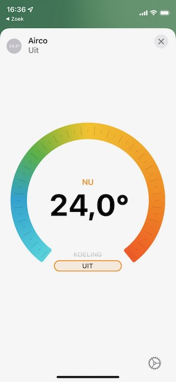
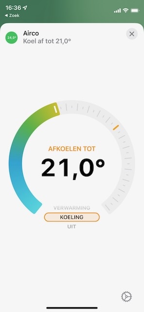
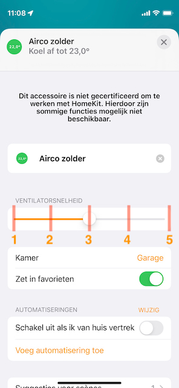
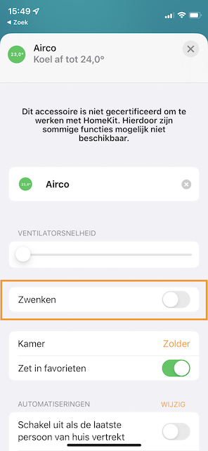

# Homebridge Daikin Cloud

[](https://badge.fury.io/js/@mp-consulting%2Fhomebridge-daikin-cloud)
[](https://github.com/mp-consulting/homebridge-daikin-cloud/actions/workflows/build.yml)
[](https://codecov.io/gh/mp-consulting/homebridge-daikin-cloud)

A [Homebridge](https://homebridge.io) plugin that integrates Daikin air conditioning units via the Daikin Cloud (Onecta) API, allowing you to control your devices through Apple HomeKit.

 

## Features

- **Temperature Control**: View current room temperature and set target temperature
- **Operation Modes**: Cooling, heating, and auto modes
- **Fan Control**: Adjust fan speed from the accessory settings
- **Swing Mode**: Enable/disable swing (if supported by your device)
- **Real-time Updates**: WebSocket support for instant device state changes (Mobile App mode)
- **Extra Features** (individually configurable):
  - Powerful mode (`showPowerfulMode`)
  - Econo mode (`showEconoMode`)
  - Streamer mode (`showStreamerMode`)
  - Outdoor silent mode (`showOutdoorSilentMode`)
  - Indoor quiet mode (`showIndoorSilentMode`)
  - Dry mode (`showDryMode`)
  - Fan only mode (`showFanOnlyMode`)

> **Note**: HomeKit doesn't natively support all Daikin operation modes. Extra features appear as switches in the Home app. Enable them individually in the plugin settings UI.

## Authentication Methods

This plugin supports two authentication methods:

| Method | API Calls/Day | WebSocket | Setup |
|--------|--------------|-----------|-------|
| **Mobile App** | 5000 | Yes | Email/password (same as Onecta app) |
| **Developer Portal** | 200 | No | OAuth with developer credentials |

**Recommended**: Mobile App authentication provides more API calls and real-time WebSocket updates.

## Requirements

- Node.js >= 18.15.0
- Homebridge >= 1.5.0
- A Daikin account with devices registered in the Onecta app

## Installation

Install via the Homebridge UI or manually:

```bash
npm install -g @mp-consulting/homebridge-daikin-cloud
```

## Setup

### Option 1: Mobile App Authentication (Recommended)

1. Open the Homebridge UI and go to the plugin settings
2. Go to the **Authentication** tab
3. Select **Mobile App** from the authentication method dropdown
4. Click **Configure Credentials**
5. Enter your Daikin Onecta account email and password
6. Click **Test & Save Credentials**
7. Restart Homebridge

### Option 2: Developer Portal Authentication

#### 1. Create a Daikin Developer App

1. Go to the [Daikin Developer Portal](https://developer.cloud.daikineurope.com/)
2. Sign in and navigate to **My Apps** (top-right menu)
3. Click **+ New App**
4. Fill in:
   - **Application name**: Any name (e.g., "Homebridge")
   - **Auth strategy**: Onecta OIDC
   - **Redirect URI**: `https://<your-homebridge-ip>:<callback-port>` (e.g., `https://192.168.1.100:8582`)
5. Save and note your **Client ID** and **Client Secret**

#### 2. Configure the Plugin

Add the platform to your Homebridge `config.json`:

```json
{
  "platforms": [
    {
      "platform": "DaikinCloud",
      "authMode": "developer_portal",
      "clientId": "<your-client-id>",
      "clientSecret": "<your-client-secret>",
      "oidcCallbackServerBindAddr": "0.0.0.0",
      "callbackServerExternalAddress": "<your-homebridge-ip>",
      "callbackServerPort": 8582
    }
  ]
}
```

#### 3. Authenticate

1. Restart Homebridge
2. Open the Homebridge UI and go to the plugin settings
3. Click **Authenticate** and follow the OAuth flow
4. After successful authentication, restart Homebridge

## Configuration Options

| Option | Type | Default | Description |
|--------|------|---------|-------------|
| `authMode` | string | `developer_portal` | Authentication method: `developer_portal` or `mobile_app` |
| `email` | string | - | Daikin account email (Mobile App mode) |
| `password` | string | - | Daikin account password (Mobile App mode) |
| `clientId` | string | - | Daikin Developer App Client ID (Developer Portal mode) |
| `clientSecret` | string | - | Daikin Developer App Client Secret (Developer Portal mode) |
| `callbackServerExternalAddress` | string | auto-detected | External IP/hostname for OAuth callback |
| `callbackServerPort` | number | `8582` | Port for OAuth callback server (1-65535) |
| `oidcCallbackServerBindAddr` | string | `0.0.0.0` | Address to bind callback server (valid IPv4) |
| `updateIntervalInMinutes` | number | `15` | Polling interval (Developer Portal: 15+ min, Mobile App: 1-5 min) |
| `forceUpdateDelay` | number | `60000` | Delay (ms) before refreshing after a change |
| `enableWebSocket` | boolean | `true` | Enable real-time updates (Mobile App mode only) |
| `excludedDevicesByDeviceId` | string[] | `[]` | Device IDs to exclude from HomeKit |
| `showPowerfulMode` | boolean | `false` | Show Powerful mode switch |
| `showEconoMode` | boolean | `false` | Show Econo mode switch |
| `showStreamerMode` | boolean | `false` | Show Streamer mode switch |
| `showOutdoorSilentMode` | boolean | `false` | Show Outdoor Silent mode switch |
| `showIndoorSilentMode` | boolean | `false` | Show Indoor Silent mode switch |
| `showDryMode` | boolean | `false` | Show Dry mode switch |
| `showFanOnlyMode` | boolean | `false` | Show Fan Only mode switch |

## API Rate Limits

| Mode | Daily Limit | Recommended Polling |
|------|-------------|---------------------|
| Developer Portal | 200 calls/day | 15+ minutes |
| Mobile App | 5000 calls/day | 1-5 minutes |

The plugin manages rate limits by:
- Polling at configurable intervals
- Triggering immediate updates after changes
- Blocking requests when the rate limit is reached
- Using WebSocket for real-time updates (Mobile App mode)

## Fan Speed

Fan speed in HomeKit uses percentages (0-100%). Map these to your device's fan levels:

| Daikin Levels | HomeKit % |
|---------------|-----------|
| 5 levels | 20%, 40%, 60%, 80%, 100% |
| 3 levels | 33%, 66%, 100% |



## Swing Mode

Toggle swing mode from the accessory settings. Both horizontal and vertical swing are activated together if supported.



## Troubleshooting

### Token Expired or Invalid

Delete the token file and restart Homebridge:
```bash
rm ~/.homebridge/.daikin-controller-cloud-tokenset
# or in your custom storage path
```

### Authentication Flow Issues

- Ensure your redirect URI in the Daikin Developer Portal matches exactly: `https://<callbackServerExternalAddress>:<callbackServerPort>`
- Try setting `oidcCallbackServerBindAddr` to `0.0.0.0`
- Check firewall rules for the callback port

### Device Not Appearing

- Check the Homebridge logs for device discovery
- Verify the device is registered in the Daikin Onecta app
- Check if the device ID is in `excludedDevicesByDeviceId`

### WebSocket Not Connecting (Mobile App Mode)

- Ensure `enableWebSocket` is set to `true`
- Check Homebridge logs for WebSocket connection errors
- Verify your credentials are valid by testing the connection in the UI

### API Gateway Timeout Errors (502, 503, 504)

These errors indicate temporary issues with the Daikin Cloud servers:
- The plugin automatically retries failed requests up to 3 times with exponential backoff
- If errors persist, the Daikin API may be experiencing extended downtime
- Check [Daikin's status page](https://www.daikin.eu/) or try again later

## Supported Devices

Any device compatible with the [Daikin Onecta app](https://www.daikin.eu/en_us/product-group/control-systems/onecta/connectable-units.html), including:

- BRP069C4x
- BRP069A8x
- BRP069A78 (Altherma heat pump)

## Development

```bash
# Install dependencies
npm install

# Build
npm run build

# Run with watch mode
npm run watch

# Run tests
npm test
```

### Code Quality

This plugin uses:
- **TypeScript strict mode** for enhanced type safety
- **Zod validation** for runtime type checking
- **ESLint** for code quality enforcement
- **Jest** with 60%+ test coverage

### Documentation

Comprehensive developer documentation is available in the [`docs/`](docs/) folder:

- **[ARCHITECTURE.md](docs/ARCHITECTURE.md)** - System architecture, component design, data flows, and extension guides
- **[IMPLEMENTATION_GUIDE.md](docs/IMPLEMENTATION_GUIDE.md)** - Step-by-step implementation guide for improvements
- **[IMPROVEMENTS_SUMMARY.md](docs/IMPROVEMENTS_SUMMARY.md)** - Summary of recent improvements and progress
- **[NEXT_STEPS.md](docs/NEXT_STEPS.md)** - Quick-start guide for contributing

For development workflows and coding conventions, see [CLAUDE.md](CLAUDE.md).

## License

[Apache-2.0](LICENSE)
