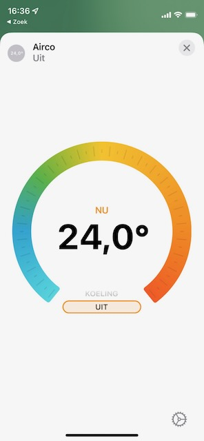
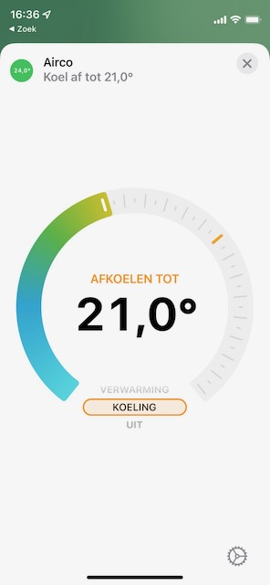
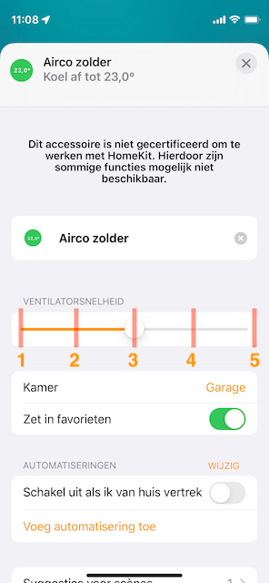
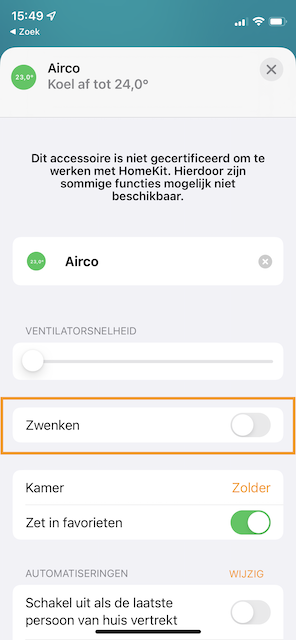

# Homebridge Daikin Cloud

[](https://badge.fury.io/js/@mp-consulting%2Fhomebridge-daikin-cloud)
[](https://github.com/mp-consulting/homebridge-daikin-cloud/actions/workflows/build.yml)
[](https://codecov.io/gh/mp-consulting/homebridge-daikin-cloud)

A [Homebridge](https://homebridge.io) plugin that integrates Daikin air conditioning units via the Daikin Cloud (Onecta) API, allowing you to control your devices through Apple HomeKit.

> Originally based on [homebridge-daikin-cloud](https://github.com/JeroenVdb/homebridge-daikin-cloud) by [Jeroen Van den Berghe](https://github.com/JeroenVdb), licensed under the Apache License 2.0. This fork has been substantially rewritten by [MP Consulting](https://github.com/mp-consulting).

 

## Features

- **Temperature Control**: View current room temperature and set target temperature
- **Operation Modes**: Cooling, heating, and auto modes
- **Fan Control**: Adjust fan speed from the accessory settings
- **Swing Mode**: Enable/disable swing (if supported by your device)
- **Real-time Updates**: WebSocket support for instant device state changes (Mobile App mode)
- **Extra Features** (individually configurable):
  - Powerful mode (`showPowerfulMode`)
  - Econo mode (`showEconoMode`)
  - Streamer mode (`showStreamerMode`)
  - Outdoor silent mode (`showOutdoorSilentMode`)
  - Indoor quiet mode (`showIndoorSilentMode`)
  - Auto fan mode (`showAutoFanMode`)
  - Oscillation switch (`showOscillationSwitch`)
  - Dry mode (`showDryMode`)
  - Fan only mode (`showFanOnlyMode`)
  - Holiday (away) mode (`showHolidayMode`)
- **Separate Fan Tile** (`showSeparateFanControl`): Expose fan speed and oscillation as a standalone Fan tile, so both stay visible even when the accessory is grouped into a single tile in the Home app
- **Firmware Updates** (`showFirmwareUpdateSwitch`): Manage gateway firmware updates from HomeKit instead of the Onecta app. The plugin logs when Daikin stages an update for your unit and exposes a "Firmware Update" switch — turn it on to install; it stays on while the update runs and the plugin logs the outcome. Not part of `showExtraFeatures`: it must be enabled explicitly, so an "all switches on" scene can never trigger an install. The unit is unavailable (and rejects commands) while it updates. The current firmware version is also shown in each accessory's HomeKit details.

> **Note**: HomeKit doesn't natively support all Daikin operation modes. Extra features appear as switches in the Home app. Enable them individually in the plugin settings UI.
>
> **Grouped tiles**: When you group the air conditioner into a single tile in the Home app, Apple hides the built-in fan speed slider and swing toggle (they're still reachable by opening the device directly). The **Oscillation switch** and **Separate Fan Tile** options work around this by exposing those controls as their own tiles, which remain visible when grouped.

## Authentication Methods

This plugin supports two authentication methods:

| Method | API Calls/Day | WebSocket | Setup |
|--------|--------------|-----------|-------|
| **Mobile App** | 3000 | Yes | Email/password (same as Onecta app) |
| **Developer Portal** | 200 | No | OAuth with developer credentials |

**Recommended**: Mobile App authentication provides more API calls and real-time WebSocket updates.

## Requirements

- Node.js 20.5+, 22.10+, 24 or 26
- Homebridge >= 1.5.0 (including 2.x)
- A Daikin account with devices registered in the Onecta app

## Installation

Install via the Homebridge UI or manually:

```bash
npm install -g @mp-consulting/homebridge-daikin-cloud
```

## Setup

### Option 1: Mobile App Authentication (Recommended)

1. Open the Homebridge UI and go to the plugin settings
2. Go to the **Authentication** tab
3. Select **Mobile App** from the authentication method dropdown
4. Click **Configure Credentials**
5. Enter your Daikin Onecta account email and password
6. Click **Test & Save Credentials**
7. Restart Homebridge

If you edit `config.json` by hand instead, the credential keys are `daikinEmail` and `daikinPassword`:

```json
{
  "platforms": [
    {
      "platform": "DaikinCloud",
      "name": "Daikin Cloud",
      "authMode": "mobile_app",
      "daikinEmail": "<your-onecta-email>",
      "daikinPassword": "<your-onecta-password>"
    }
  ]
}
```

### Option 2: Developer Portal Authentication

#### 1. Create a Daikin Developer App

1. Go to the [Daikin Developer Portal](https://developer.cloud.daikineurope.com/)
2. Sign in and navigate to **My Apps** (top-right menu)
3. Click **+ New App**
4. Fill in:
   - **Application name**: Any name (e.g., "Homebridge")
   - **Auth strategy**: Onecta OIDC
   - **Redirect URI**: `https://<your-homebridge-ip>:<callback-port>` (e.g., `https://192.168.1.100:8582`)
5. Save and note your **Client ID** and **Client Secret**

#### 2. Configure the Plugin

Add the platform to your Homebridge `config.json`:

```json
{
  "platforms": [
    {
      "platform": "DaikinCloud",
      "name": "Daikin Cloud",
      "authMode": "developer_portal",
      "clientId": "<your-client-id>",
      "clientSecret": "<your-client-secret>",
      "oidcCallbackServerBindAddr": "0.0.0.0",
      "callbackServerExternalAddress": "<your-homebridge-ip>",
      "callbackServerPort": 8582
    }
  ]
}
```

#### 3. Authenticate

1. Restart Homebridge
2. Open the Homebridge UI and go to the plugin settings
3. Click **Authenticate** and follow the OAuth flow
4. After successful authentication, restart Homebridge

## Configuration Options

| Option | Type | Default | Description |
|--------|------|---------|-------------|
| `authMode` | string | `developer_portal` | Authentication method: `developer_portal` or `mobile_app` |
| `daikinEmail` | string | - | Daikin account email (Mobile App mode) |
| `daikinPassword` | string | - | Daikin account password (Mobile App mode) |
| `clientId` | string | - | Daikin Developer App Client ID (Developer Portal mode) |
| `clientSecret` | string | - | Daikin Developer App Client Secret (Developer Portal mode) |
| `callbackServerExternalAddress` | string | - | IP/hostname your browser uses to reach Homebridge for the OAuth callback (Developer Portal mode; the settings UI suggests this host's LAN IP) |
| `callbackServerPort` | number | `8582` | Port for OAuth callback server (1-65535) |
| `oidcCallbackServerBindAddr` | string | `0.0.0.0` | Interface the temporary OAuth callback server listens on. Use `0.0.0.0` unless the browser you log in with runs on the Homebridge host itself; only then does a loopback address (`127.0.0.1`) work. The settings UI refuses to start authentication with a loopback bind address and a non-loopback callback address |
| `updateIntervalInMinutes` | number | `15` | Polling interval, 1-60 (Developer Portal: 15+ min, Mobile App: 1-5 min). Stretched automatically, see [API Rate Limits](#api-rate-limits) |
| `forceUpdateDelay` | number | `60000` | Delay (ms, 5000-300000) before refreshing after a change from HomeKit. Skipped while the WebSocket is connected |
| `enableWebSocket` | boolean | `true` | Enable real-time updates (Mobile App mode only) |
| `httpTransport` | string | `node` | `node` or `curl`. Use `curl` only if authentication times out on your network while curl works — some WAFs drop Node's TLS fingerprint ([#6](https://github.com/mp-consulting/homebridge-daikin-cloud/issues/6)). Requires the curl binary; WebSocket still uses Node TLS. Env override: `DAIKIN_HTTP_TRANSPORT` |
| `excludedDevicesByDeviceId` | string[] | `[]` | Device IDs to exclude from HomeKit |
| `showExtraFeatures` | boolean | `false` | Legacy catch-all: default for every per-feature switch below marked *follows `showExtraFeatures`* |
| `showPowerfulMode` | boolean | follows `showExtraFeatures` | Show Powerful mode switch |
| `showEconoMode` | boolean | follows `showExtraFeatures` | Show Econo mode switch |
| `showStreamerMode` | boolean | follows `showExtraFeatures` | Show Streamer mode switch |
| `showOutdoorSilentMode` | boolean | follows `showExtraFeatures` | Show Outdoor Silent mode switch |
| `showIndoorSilentMode` | boolean | follows `showExtraFeatures` | Show Indoor Silent mode switch |
| `showAutoFanMode` | boolean | follows `showExtraFeatures` | Show Auto fan mode switch (toggles fan speed between auto and manual) |
| `showOscillationSwitch` | boolean | follows `showExtraFeatures` | Show fan oscillation (swing) as a separate switch (stays visible when the accessory is grouped into a single tile) |
| `showDryMode` | boolean | follows `showExtraFeatures` | Show Dry mode switch |
| `showFanOnlyMode` | boolean | follows `showExtraFeatures` | Show Fan Only mode switch |
| `showHolidayMode` | boolean | follows `showExtraFeatures` | Show Holiday (away) mode switch: on puts the unit into holiday mode, off resumes normal operation |
| `showSeparateFanControl` | boolean | `false` | Expose fan speed and oscillation as a standalone Fan tile (stays visible when the accessory is grouped into a single tile) |
| `showFirmwareUpdateSwitch` | boolean | `false` | Show a Firmware Update switch that installs staged gateway firmware updates (never enabled implicitly by `showExtraFeatures`) |

All feature switches only appear if the device supports the feature.

## API Rate Limits

| Mode | Daily Limit | Recommended Polling |
|------|-------------|---------------------|
| Developer Portal | 200 calls/day | 15+ minutes |
| Mobile App | 3000 calls/day | 1-5 minutes |

The plugin manages rate limits by:
- Polling at the configured interval (`updateIntervalInMinutes`)
- **Stretching polling while the WebSocket is connected**: push updates already deliver changes, so polling drops to a safety-net interval of at least 60 minutes, and the forced refresh after a change from HomeKit is skipped. When the WebSocket disconnects, the configured interval applies again (and a reconnect triggers one catch-up poll)
- **Backing off on failures**: each consecutive failed poll doubles the interval (up to 4x); polling GETs are not retried on 502/503/504, the next poll is the retry
- Stretching polling to at least 60 minutes when fewer than 20 calls are left for the day
- Debouncing refreshes after changes, and coalescing rapid writes to the same setting into one API call
- Blocking requests when the rate limit is reached (until the `Retry-After` time)

The settings UI is careful with the quota too: it caches the device list for 5 minutes, and the rate-limit display reads the status from the last API response the plugin received (saved to a file in the Homebridge storage directory) instead of making an API call.

## Fan Speed

Fan speed in HomeKit uses percentages (0-100%). Map these to your device's fan levels:

| Daikin Levels | HomeKit % |
|---------------|-----------|
| 5 levels | 20%, 40%, 60%, 80%, 100% |
| 3 levels | 33%, 66%, 100% |



## Swing Mode

Toggle swing mode from the accessory settings. Both horizontal and vertical swing are activated together if supported.



## Troubleshooting

### Token Expired or Invalid

Delete the token file and restart Homebridge:
```bash
rm ~/.homebridge/.daikin-controller-cloud-tokenset
# or in your custom storage path
```

### Authentication Flow Issues

- Ensure your redirect URI in the Daikin Developer Portal matches exactly: `https://<callbackServerExternalAddress>:<callbackServerPort>`
- Set `oidcCallbackServerBindAddr` to `0.0.0.0`; a loopback bind address (`127.0.0.1`) only works when the browser runs on the Homebridge host itself
- The temporary callback server stops automatically after 10 minutes: if you took longer, start authentication again
- Check firewall rules for the callback port

### Device Not Appearing

- Check the Homebridge logs for device discovery
- Verify the device is registered in the Daikin Onecta app
- Check if the device ID is in `excludedDevicesByDeviceId`

### WebSocket Not Connecting (Mobile App Mode)

- Ensure `enableWebSocket` is set to `true`
- Check Homebridge logs for WebSocket connection errors
- Verify your credentials are valid by testing the connection in the UI

### API Gateway Timeout Errors (502, 503, 504)

These errors indicate temporary issues with the Daikin Cloud servers:
- Writes (and one-off reads) are retried up to 3 times with exponential backoff
- Periodic polls are not retried; instead the poll interval backs off until the API recovers
- If errors persist, the Daikin API may be experiencing extended downtime
- Check [Daikin's status page](https://www.daikin.eu/) or try again later

## Supported Devices

Any device compatible with the [Daikin Onecta app](https://www.daikin.eu/en_us/product-group/control-systems/onecta/connectable-units.html), including:

- BRP069C4x
- BRP069A8x
- BRP069A78 (Altherma heat pump)

## Development

```bash
# Install dependencies
npm install

# Build
npm run build

# Run with watch mode
npm run watch

# Run tests
npm test

# Run tests with coverage (thresholds in vitest.config.mts, enforced in CI)
npm run test:coverage

# Check for Daikin API schema drift (fetches live devices, diffs raw vs Zod-parsed,
# reports any silently-stripped fields). Needs real credentials in
# test/hbConfig/config.json, so it is a manual check and not run in CI.
# Add --dump-fixtures to also write per-device fixtures to test/fixtures/live/.
npm run schema:check
```

### Code Quality

This plugin uses:
- **TypeScript strict mode** for enhanced type safety
- **Zod validation** for runtime type checking
- **ESLint** for code quality enforcement
- **Vitest** with coverage thresholds enforced in CI (currently ~80% of statements), including the custom UI server

### Documentation

Comprehensive developer documentation is available in the [`docs/`](docs/) folder:

- **[ARCHITECTURE.md](docs/ARCHITECTURE.md)** - System architecture, component design, data flows, and extension guides
- **[TROUBLESHOOTING.md](docs/TROUBLESHOOTING.md)** - Common problems and fixes

For development workflows and coding conventions, see [CLAUDE.md](CLAUDE.md).

## License

The original work by [Jeroen Van den Berghe](https://github.com/JeroenVdb) is licensed under the [Apache License 2.0](https://www.apache.org/licenses/LICENSE-2.0). Modifications and new code by [MP Consulting](https://github.com/mp-consulting) are licensed under the [MIT License](https://opensource.org/licenses/MIT). See the [LICENSE](LICENSE) file for full details.
